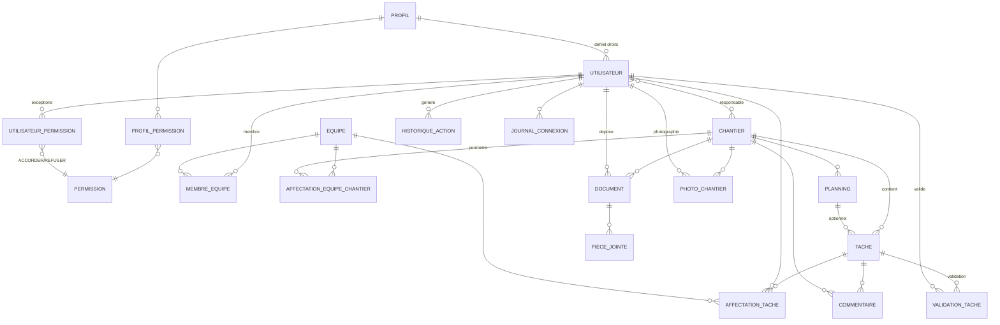

# MCD FINAL — Modèle Conceptuel des Données — CMS

Version : 1.0
Statut : Conceptuel validé (aucun code, aucune table, aucune Entity)
Base : LOOP 2.5
Sources : dictionnaire v1.2, relations (LOOP 2.3), cardinalités (LOOP 2.4)

Référence pour : LOOP 2.6 (MCD → MLD), conception PostgreSQL, Entity JPA.

---

# 1. DIAGRAMME MCD

## 1.1 Vue Mermaid (ER)



## 1.2 Vue ASCII (par module)

```
=========================================================
 MODULE RBAC
=========================================================
UTILISATEUR (0,N) ---< possède >--- (1,1) PROFIL
PROFIL (0,N) ------< ProfilPermission >------ (0,N) PERMISSION
UTILISATEUR (0,N) --< UtilisateurPermission >-- (0,N) PERMISSION
                                              (type ACCORDER/REFUSER)

=========================================================
 MODULE ORGANISATION
=========================================================
UTILISATEUR (0,N) ---< MembreEquipe >--- (0,N) EQUIPE
EQUIPE (0,N) --< AffectationEquipeChantier >-- (0,N) CHANTIER
UTILISATEUR (0,N) ---< responsable de >--- (0,1) CHANTIER
CHANTIER (1,1) -----< contient >----- (0,N) TACHE

=========================================================
 MODULE TRAVAIL
=========================================================
TACHE (1,1) ---< AffectationTache >--- (0,N) [UTILISATEUR (0,1) | EQUIPE (0,1)]
TACHE (1,1) ---< ValidationTache >--- (0,N) UTILISATEUR (validateur)
[TACHE (0,1) | CHANTIER (0,1)] ---< Commentaire >--- (0,N)
CHANTIER (1,1) ---< Planning >--- (0,N)
TACHE (0,N) ---< rattachée à >--- (0,1) PLANNING

=========================================================
 MODULE DOCUMENTS
=========================================================
CHANTIER (0,N) ---< Document >--- (1,1)
DOCUMENT (1,1) ---< PieceJointe >--- (0,N)
CHANTIER (1,1) ---< PhotoChantier >--- (0,N)

=========================================================
 MODULE TRAÇABILITÉ
=========================================================
UTILISATEUR (1,1) ---< HistoriqueAction >--- (0,N)
UTILISATEUR (1,1) ---< JournalConnexion >--- (0,N)
```

---

# 2. LISTE DES ENTITÉS (19)

| # | Entité | Rôle métier |
|---|--------|-------------|
| 1 | Utilisateur | Compte de connexion, base de l'authentification |
| 2 | Profil | Rôle métier portant des droits par défaut |
| 3 | Permission | Action autorisée, unité du RBAC |
| 4 | ProfilPermission | Liaison Profil ↔ Permission |
| 5 | UtilisateurPermission | Exception individuelle ACCORDER / REFUSER |
| 6 | Chantier | Projet central de construction |
| 7 | Equipe | Groupe de travail |
| 8 | MembreEquipe | Appartenance Utilisateur ↔ Equipe |
| 9 | AffectationEquipeChantier | Équipe affectée à un chantier (période) |
| 10 | Tache | Unité de travail du chantier |
| 11 | AffectationTache | Affectation d'une tâche (utilisateur ou équipe) |
| 12 | ValidationTache | Décision de validation d'une tâche |
| 13 | Planning | Période de planification d'un chantier |
| 14 | Commentaire | Échange textuel (tâche ou chantier) |
| 15 | HistoriqueAction | Journal d'audit des actions |
| 16 | JournalConnexion | Traces de connexion/déconnexion |
| 17 | Document | Document métier du chantier |
| 18 | PieceJointe | Fichier associé (polymorphique / document) |
| 19 | PhotoChantier | Photo d'avancement du chantier |

---

# 3. LISTE DES ASSOCIATIONS

| Association | Entités | Cardinalités | Règle |
|-------------|---------|--------------|-------|
| UTILISATEUR_POSSEDE_PROFIL | Utilisateur — Profil | UTILISATEUR (0,N) — (1,1) PROFIL | Un profil peut être partagé ; chaque utilisateur a un profil |
| PROFIL_POSSEDE_PERMISSION | Profil — Permission | PROFIL (0,N) — (0,N) PERMISSION | Via ProfilPermission ; attribution dynamique |
| UTILISATEUR_POSSEDE_PERMISSION_SPECIFIQUE | Utilisateur — Permission | UTILISATEUR (0,N) — (0,N) PERMISSION | Via UtilisateurPermission ; ACCORDER/REFUSER, REFUSER prioritaire |
| UTILISATEUR_APPARTIENT_EQUIPE | Utilisateur — Equipe | UTILISATEUR (0,N) — (0,N) EQUIPE | Via MembreEquipe ; rôle CHEF/OUVRIER, dateIntegration |
| EQUIPE_PARTICIPE_CHANTIER | Equipe — Chantier | EQUIPE (0,N) — (0,N) CHANTIER | Via AffectationEquipeChantier ; base sécurité des données |
| UTILISATEUR_RESPONSABLE_CHANTIER | Utilisateur — Chantier | UTILISATEUR (0,N) — (0,1) CHANTIER | Un chantier a au plus un responsable ; actif ⇒ responsable obligatoire |
| CHANTIER_CONTIENT_TACHE | Chantier — Tache | CHANTIER (0,N) — (1,1) TACHE | Toute tâche appartient à un chantier |
| TACHE_POSSEDE_AFFECTATION | Tache — AffectationTache | TACHE (1,1) — (0,N) AFFECTATION_TACHE | Une tâche, plusieurs affectations |
| UTILISATEUR_RECEVOIR_AFFECTATION | Utilisateur — AffectationTache | UTILISATEUR (0,N) — (0,1) AFFECTATION_TACHE | Cible utilisateur optionnelle |
| EQUIPE_RECEVOIR_AFFECTATION | Equipe — AffectationTache | EQUIPE (0,N) — (0,1) AFFECTATION_TACHE | Cible équipe optionnelle |
| TACHE_POSSEDE_VALIDATION | Tache — Utilisateur (validateur) | TACHE (1,1) — (0,N) VALIDATION_TACHE | Historique des validations conservé |
| TACHE_POSSEDE_COMMENTAIRE | Tache — Commentaire | TACHE (0,1) — (0,N) COMMENTAIRE | Un commentaire a un seul contexte |
| CHANTIER_RECOIT_COMMENTAIRE | Chantier — Commentaire | CHANTIER (0,1) — (0,N) COMMENTAIRE | Contexte alternatif au commentaire |
| CHANTIER_POSSEDE_PLANNING | Chantier — Planning | CHANTIER (1,1) — (0,N) PLANNING | Plusieurs plannings par chantier |
| TACHE_RATTACHEE_PLANNING | Tache — Planning | PLANNING (0,N) — (0,1) TACHE | Rattachement optionnel (dictionnaire) |
| CHANTIER_POSSEDE_DOCUMENT | Chantier — Document | CHANTIER (0,N) — (1,1) DOCUMENT | Tout document appartient à un chantier |
| DOCUMENT_POSSEDE_PIECE_JOINTE | Document — PieceJointe | DOCUMENT (1,1) — (0,N) PIECE_JOINTE | Plusieurs fichiers par document |
| CHANTIER_POSSEDE_PHOTO | Chantier — PhotoChantier | CHANTIER (1,1) — (0,N) PHOTO_CHANTIER | Photos illimitées |
| UTILISATEUR_GENERE_HISTORIQUE | Utilisateur — HistoriqueAction | UTILISATEUR (1,1) — (0,N) HISTORIQUE_ACTION | Toute action tracée liée à un utilisateur |
| UTILISATEUR_POSSEDE_JOURNAL_CONNEXION | Utilisateur — JournalConnexion | UTILISATEUR (1,1) — (0,N) JOURNAL_CONNEXION | Chaque connexion liée à un utilisateur |

## Associations portées par des attributs (LOOP 2.4)

| Association | Cardinalités | Porté par |
|-------------|--------------|-----------|
| UTILISATEUR_CREE_TACHE | UTILISATEUR (0,N) — (1,1) TACHE | Tache.createdBy |
| UTILISATEUR_DEPOSE_DOCUMENT | UTILISATEUR (0,N) — (1,1) DOCUMENT | Document.uploader |
| UTILISATEUR_PHOTOGRAPHIE | UTILISATEUR (0,N) — (1,1) PHOTO_CHANTIER | PhotoChantier.utilisateur |
| UTILISATEUR_ECRIT_COMMENTAIRE | UTILISATEUR (0,N) — (1,1) COMMENTAIRE | Commentaire.auteur |
| UTILISATEUR_DECIDE_EXCEPTION | UTILISATEUR (0,N) — (1,1) UTILISATEUR_PERMISSION | UtilisateurPermission.createdBy |

---

# 4. CONTRAINTES MÉTIER

## 4.1 RBAC dynamique
* Un utilisateur a exactement un profil.
* Droits effectifs = Permissions du profil + ACCORDER − REFUSER.
* REFUSER est prioritaire.
* Gestion 100 % en base (ProfilPermission, UtilisateurPermission).

## 4.2 Sécurité par périmètre
* Niveau 1 — permission fonctionnelle (TACHE_VIEW, CHANTIER_UPDATE...).
* Niveau 2 — restriction des données : un utilisateur ne voit que les chantiers
  de ses équipes affectées (AffectationEquipeChantier), ses équipes
  (MembreEquipe), ses tâches affectées (AffectationTache).
* Une permission ne donne jamais accès à toutes les données.

## 4.3 Responsable de chantier
* Un chantier a au plus un responsable (0,1).
* Un chantier actif doit avoir un responsable.
* Le responsable gère son chantier et le voit en entier.

## 4.4 Affectation de tâche
* Une affectation cible un utilisateur et/ou une équipe.
* Au moins une cible obligatoire (jamais de cible vide).
* Rôle tracé : REALISATEUR / CONTROLEUR.

## 4.5 Commentaire
* Un commentaire appartient à un et un seul contexte : une tâche OU un chantier.

## 4.6 Historique / traçabilité
* Toute action sensible est tracée (HistoriqueAction), immuable.
* Chaque action est liée à un utilisateur (1,1).
* Connexions et déconnexions tracées (JournalConnexion), y compris les échecs.

## 4.7 Profils système initiaux
* ADMINISTRATEUR (gestion complète) et UTILISATEUR_STANDARD (accès limité,
  pas de données globales).

---

# 5. POINTS DE VIGILANCE POUR LE LOOP 2.6 (MCD → MLD)

1. **PieceJointe** : le MCD retient Document (1,1) — (0,N) PieceJointe, alors que
   le dictionnaire v1.2 la définit polymorphique (TACHE / COMMENTAIRE /
   VALIDATION). À trancher au MLD (entiteType élargi ou relation dédiée).
2. **Chantier — Document** : le MCD impose (1,1) côté Document (rattachement
   obligatoire), le dictionnaire le prévoyait optionnel → le MCD prime.
3. **Tache — Planning** : association optionnelle (0,1), issue du dictionnaire,
   conservée en complémentaire.

---

FIN DU DOCUMENT — MCD FINAL VALIDÉ
