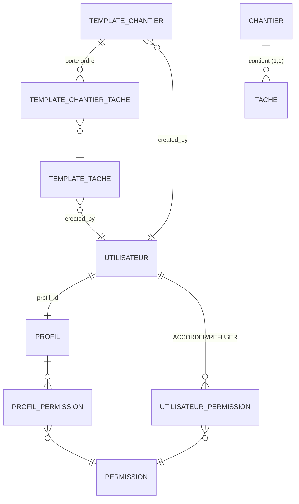
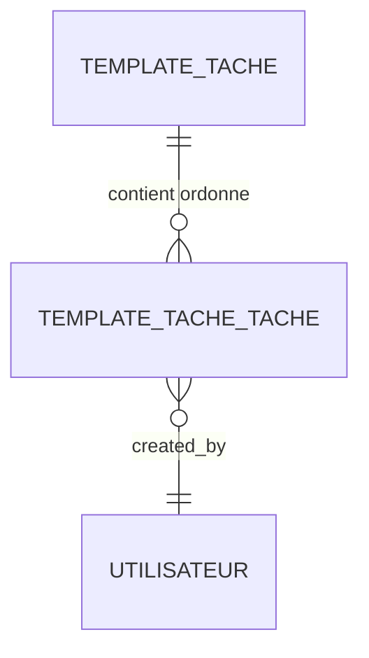

# RAPPORT LOOP INGÉNIERIE

Version : 1.0
Date : 13/08/2026
Périmètre : Module Template (TemplateChantier / TemplateTache) + RBAC (Profil / Permission / Utilisateur)
Objet : Audit MCD/MLD avant toute modification — conformité RÈGLE ABSOLUE

---

## Résumé exécutif

Le modèle existant (V1 → V4) est **globalement sain et normalisé**. L'audit confirme que
la plupart des fonctionnalités demandées sont **déjà couvertes** par les relations et
endpoints existants. Trois écarts précis ont été identifiés, dont **un seul nécessite une
évolution du modèle** (ajout d'une table). Aucune modification du schéma n'est nécessaire
pour le RBAC ou le profil utilisateur.

Décision finale : **🟢 MODÈLE VALIDÉ — implémentation autorisée avec un ajout de table**
(voir §12).

---

## 1. Modèle actuel (MCD)

### 1.1 Diagramme Mermaid



### 1.2 Cardinalités (MERISE)

| Association | Entités | Cardinalités | Support |
|---|---|---|---|
| TemplateChantier ↔ TemplateTache | TemplateChantier — TemplateTache | (0,N) — (0,N) | `template_chantier_tache` (transitive, porte `ordre`) |
| TemplateChantier — Utilisateur | (créateur) | (1,1) — (0,N) | `template_chantier.created_by` |
| TemplateTache — Utilisateur | (créateur) | (1,1) — (0,N) | `template_tache.created_by` |
| Utilisateur — Profil | (appartient) | (0,N) — (1,1) | `utilisateur.profil_id` |
| Profil — Permission | (via ProfilPermission) | (0,N) — (0,N) | `profil_permission` |
| Utilisateur — Permission | (exceptions) | (0,N) — (0,N) | `utilisateur_permission` (type ACCORDER/REFUSER) |
| Chantier — Tache | (contient) | (0,N) — (1,1) | `tache.chantier_id` |

### 1.3 Liste des entités Template (existantes)

| Table | Rôle | Cardinalités notables |
|---|---|---|
| `template_chantier` | Modèle complet de construction (nom UNIQUE, statut ACTIF/INACTIF) | FK `created_by` |
| `template_tache` | Groupe réutilisable de tâches (titre/description/priorite/duree) | FK `created_by` |
| `template_chantier_tache` | N:N TemplateChantier↔TemplateTache, porte l'ordre, UNIQUE (chantier, ordre) et (chantier, tache), FK cascade sur chantier | 2 FK + ordre |

---

## 2. Modèle cible (MCD)

L'audit conclut : le modèle existant **répond déjà** aux besoins 1–6 de la LOOP sauf l'exigence
"TemplateTache contient un ensemble structuré de tâches » (LOOP §1, §2, §6). Ce besoin n'est
**pas** représentable par une relation existante → une table d'association est justifiée
(voir §4).

### 2.1 Diagramme Mermaid (ajout uniquement)



### 2.2 Cardinalités cibles

| Nouvelle association | Entités | Cardinalités | Support |
|---|---|---|---|
| TemplateTache ↔ Tache modèle (structure) | TemplateTache — TacheTemplateItem | (1,1) — (0,N) | `template_tache_tache` (ligne de structure, ordre) |

**Précision conceptuelle (LOOP §6)** : il s'agit de tâches **modèle** (structure), PAS de
tâches réelles d'un chantier. Une tâche réelle vit dans `tache` (FK `chantier_id` NOT NULL).
La table `template_tache_tache` porte des **copies de structure** (titre/description/priorite/
duree/ordre), indépendantes : elle ne référence **pas** `tache`. Ceci évite toute confusion
tâche modèle / tâche opérationnelle et toute dépendance permanente (cohérent avec la
règle d'import snapshot).

---

## 3. Modifications MCD

| Élément | Type | Justification |
|---|---|---|
| `template_tache_tache` | **NOUVELLE table** (1,N côté TemplateTache) | Permet "TemplateTache contient N tâches structurées" (LOOP §1). Aucune relation existante ne le permet. |
| `template_tache` | **Aucune modification** | Porte uniquement l'en-tête du TemplateTache (titre, description, priorite, duree). |
| `template_chantier_tache` | **Réutilisée telle quelle** | Associer import TemplateTache → TemplateChantier = N:N déjà couvert (LOOP §5, §19). |
| `tache` | **Aucune modification** | Ne stocke que les tâches réelles de chantier ; n'est pas référencée par les templates (indépendance snapshot). |

---

## 4. Nouvelles relations

### 4.1 Table `template_tache_tache` (LOOP §1, §2, §6)

Lien entre un `TemplateTache` (en-tête) et ses tâches structurées (sous-éléments).

| Colonne | Type | Contrainte |
|---|---|---|
| `id` | BIGSERIAL | PK |
| `template_tache_id` | BIGINT | NOT NULL, FK → `template_tache.id` ON DELETE CASCADE |
| `titre` | VARCHAR(255) | NOT NULL |
| `description` | VARCHAR(1000) | NULL |
| `priorite` | VARCHAR(10) | NOT NULL DEFAULT 'MOYENNE', CHECK IN ('HAUTE','MOYENNE','BASSE') |
| `duree_estimee_jours` | INTEGER | NULL, CHECK (duree > 0) |
| `ordre` | INTEGER | NOT NULL, CHECK (ordre >= 1) |
| `date_creation` | TIMESTAMP | NOT NULL |
| `date_modification` | TIMESTAMP | NOT NULL |
| `created_by` | BIGINT | NOT NULL, FK → `utilisateur.id` |

Contraintes :
- `uk_template_tache_tache_ordre` UNIQUE (`template_tache_id`, `ordre`) — ordre unique par en-tête ;
- `uk_template_tache_tache_titre` UNIQUE (`template_tache_id`, `titre`(255)) — empêche doublons (LOOP §4 point 5) ;
- `ix_template_tache_tache_template_id` (template_tache_id) — index pour jointure/filtre.

**Deux relations réutilisées** :
- `template_chantier_tache` — association N:N existante pour "TemplateChantier import TemplateTache" (LOOP §3, §5, §19) ;
- `utilisateur` (FK `created_by`) — traçabilité.

**Aucune relation redondante** : l'import dans un chantier réel reste un snapshot (copie),
aucune FK permanente `template_*` vers `chante_*`/`tache` n'est ajoutée.

---

## 5. Relations réutilisées

| Relation | Utilisation dans la LOOP | Commentaire |
|---|---|---|
| `template_chantier_tache` (N:N) | LOOP §3, §5, §19 (TemplateChantier ↔ TemplateTache) | DÉJÀ implémentée : `associerTemplateTache`/`retirerTemplateTache` (contrôleur + service + tests). |
| `template_chantier.created_by`, `template_tache.created_by` | Traçabilité | DÉJÀ présentes. |
| Profil — ProfilPermission — Permission | LOOP §10, §11 (habilitations) | DÉJÀ normalisée, pas de JSON dénormalisé. |
| Utilisateur → Profil (profil_id) | LOOP §12 | DÉJÀ présente ; il manque simplement l'endpoint de changement (voir §8). |
| UtilisateurPermission (ACCORDER/REFUSER) | LOOP §11 (REFUSER > ACCORDER) | DÉJÀ en place, REFUSER prioritaire. |

---

## 6. Permissions existantes réutilisées

| Permission | Module/Action | Utilisation |
|---|---|---|
| `TEMPLATE_CHANTIER_LIRE` | LIRE | Consultation TemplateChantier + recherche |
| `TEMPLATE_CHANTIER_CREER` | CREER | Création TemplateChantier |
| `TEMPLATE_CHANTIER_MODIFIER` | MODIFIER | Modification + désactivation + **importer un TemplateTache** (association) |
| `TEMPLATE_TACHE_LIRE` | LIRE | Consultation TemplateTache + recherche + **importer une tâche dans TemplateTache** (lecture du référentiel de tâches types…) |
| `TEMPLATE_TACHE_CREER` | CREER | Création TemplateTache |
| `TEMPLATE_TACHE_MODIFIER` | MODIFIER | Modification + ajout/retrait de tâches structurées + désactivation éventuelle |
| `PROFIL_LIRE` / `PROFIL_CREER` / `PROFIL_MODIFIER` | RBAC | Gestion habilitations (déjà utilisées) |
| `UTILISATEUR_CREER` / `UTILISATEUR_MODIFIER` | RBAC | Création utilisateur + changement de profil |

---

## 7. Permissions nouvelles proposées

**Aucune permission nouvelle n'est nécessaire après audit.**

Justification (LOOP §8, §9) :
- L'import « TemplateTache dans TemplateChantier » = **association existante** protégée par
  `TEMPLATE_CHANTIER_MODIFIER` (déjà le cas : `associerTemplateTache`). Pas de permission
  LIRE pour une écriture.
- L'import « tâche dans TemplateTache » (ajout d'une tâche structurée) est une **modification
  du TemplateTache** → `TEMPLATE_TACHE_MODIFIER`. Pas besoin de `TEMPLATE_TACHE_IMPORTER_TACHE`.
- L'import « TemplateChantier/Tache → Chantier réel » reste un snapshot protégé par
  `TEMPLATE_CHANTIER_LIRE`/`TEMPLATE_TACHE_LIRE` + contrôle d'accès au chantier (Niveau 2),
  conformément à V3 (aucune permission IMPORT dédiée) — inutile d'en créer.
- La granularité du RBAC dynamique existant (REFUSER > ACCORDER, exceptions individuelles)
  couvre déjà tout besoin d'écriture vs lecture.

---

## 8. API

### 8.1 Endpoints existants (réutilisés, sans doublon)

| Méthode | Path | Permission |
|---|---|---|
| POST/GET | `/api/v1/template-chantiers`, `/template-chantiers/{id}` | TEMPLATE_CHANTIER_CREER/LIRE |
| PUT | `/api/v1/template-chantiers/{id}` | TEMPLATE_CHANTIER_MODIFIER |
| PATCH | `/api/v1/template-chantiers/{id}/desactiver` | TEMPLATE_CHANTIER_MODIFIER |
| POST/DELETE | `/api/v1/template-chantiers/{id}/taches/{ttId}` | TEMPLATE_CHANTIER_MODIFIER |
| GET | `/api/v1/template-chantiers/{id}/taches` | TEMPLATE_CHANTIER_LIRE |
| POST | `/api/v1/template-chantiers/{id}/import?chantierId=` | TEMPLATE_CHANTIER_LIRE + accès chantier |
| POST/GET | `/api/v1/template-taches`, `/template-taches/{id}` | TEMPLATE_TACHE_CREER/LIRE |
| PUT | `/api/v1/template-taches/{id}` | TEMPLATE_TACHE_MODIFIER |
| POST | `/api/v1/template-taches/{id}/import?chantierId=` | TEMPLATE_TACHE_LIRE + accès chantier |
| GET/POST | `/api/v1/profils`, `/profils/{id}`, `/profils/actifs` | PROFIL_LIRE/CREER |
| PUT | `/api/v1/profils/{id}` | PROFIL_MODIFIER |
| POST/DELETE | `/api/v1/profils/{id}/permissions/{pid}` | PROFIL_MODIFIER |
| GET | `/api/v1/profils/{id}/permissions` | PROFIL_LIRE |
| POST | `/api/v1/users` | UTILISATEUR_CREER |
| PUT | `/api/v1/users/{id}` | UTILISATEUR_MODIFIER |
| POST | `/api/v1/users/{id}/permissions/.../{accorder|refuser}` | UTILISATEUR_MODIFIER |

### 8.2 Endpoints à AJOUTER (frontend/backend)

**Recherche par nom (LOOP §7)** — ajout côte backend sur les listes existantes :

| Méthode | Path | Param | Source |
|---|---|---|---|
| GET | `/api/v1/template-chantiers` | `nom` (optionnel) | filtrage délégué côte base → `findByNomContainingIgnoreCase` |
| GET | `/api/v1/template-taches` | `nom` (optionnel) | `findByTitreContainingIgnoreCase` |

**Tâches structurées d'un TemplateTache (LOOP §1, §2, §18)** :

| Méthode | Path | Permission |
|---|---|---|
| GET | `/api/v1/template-taches/{id}/taches` | TEMPLATE_TACHE_LIRE |
| POST | `/api/v1/template-taches/{id}/taches` | TEMPLATE_TACHE_MODIFIER |
| POST | `/api/v1/template-taches/{id}/taches/import?tacheId=` | TEMPLATE_TACHE_MODIFIER (copie d'une tâche réelle ou d'un modèle) |
| PUT | `/api/v1/template-taches/{id}/taches/{itemId}` | TEMPLATE_TACHE_MODIFIER |
| DELETE | `/api/v1/template-taches/{id}/taches/{itemId}` | TEMPLATE_TACHE_MODIFIER |

**Changement de profil utilisateur (LOOP §12)** — l'endpoint manquant côté backend :

| Méthode | Path | Permission |
|---|---|---|
| PUT | `/api/v1/users/{id}/profil?profilId=` | UTILISATEUR_MODIFIER |

> L'inscription publique (`POST /auth/register`) reste inchangée : `profilId` forcé à
> `UTILISATEUR_STANDARD` (LOOP §13). Vérifié : `AuthenticationServiceImpl.inscrire` force
> `request.setProfilId(null)`.

---

## 9. Frontend

### 9.1 État actuel (audit)

| Écran | Existant | Manquant |
|---|---|---|
| Templates Chantier | Liste, création, modification, désactivation, détail, association TemplateTache, import → chantier | Recherche par nom |
| Templates Tâche | Liste, création, modification, import → chantier | **Détail des tâches structurées** (liste des sous-tâches), ajout/retrait, import tâche, **recherche par nom** |
| Habilitations | Onglets Profils/Permissions/Utilisateurs, matrice Profil×Permission, créer/modifier profil | **Page détail Profil** (navigation Profils → Détail → permissions) — la matrice couvre déjà l'accord/refus, mais la LOOP §10 demande une vue détail ; à créer côté UX |
| Utilisateurs | Créer/éditer (Profil existant dans CreateUserModal) | Édition du profil d'un utilisateur côté backend (actuellement ignoré) ; dropdown Profil déjà dans l'UI d'édition mais inactif côte serveur |

### 9.2 Ajouts frontend planifiés

1. **Templates Tâche** : nouvelle vue détail `/templates/tache/:id` (titre, description,
   priorité, durée) + liste des tâches structurées [Ajouter une tâche] [Importer une tâche]
   [Modifier] [Supprimer] (LOOP §18).
2. **Recherche par nom** : champ de recherche sur Template-Tâche et Template-Chantier
   (query cahien côte serveur).
3. **Habilitations → détail Profil** : page `/habilitations/profil/:id` avec navigation
   « Profils → Détail → Permissions » et cases à cocher ACCORDER/REFUSER (LOOP §10, §20),
   en réutilisant la matrice existante.
4. **Utilisateurs → édition** : activer réellement le changement de profil (appel au nouvel
   endpoint `PUT /users/{id}/profil`) (LOOP §21).

---

## 10. Tests backend

### 10.1 Tests existants à conserver/adapter

- `template/service/TemplateChantierServiceImplTest` — CRUD, association, import snapshot, RBAC.
- `template/service/TemplateTacheServiceImplTest` — CRUD, import.
- `template/integration/TemplateImportIntegrationTest` — CAS1/CAS2/CAS3 (indépendance post-import).
- `template/integration/TemplatePersistenceIntegrationTest` — contraintes SQL.
- `template/controller/TemplateChantierControllerTest`, `TemplateTacheControllerTest` — RBAC.
- `profil/ProfilServiceImplTest` + `ProfilControllerTest`, `utilisateur/*`, `security/DroitsServiceTest`,
  `rbac/*` — RBAC profils/permissions, REFUSER>ACCORDER, admin=all.

### 10.2 Nouveaux tests à ajouter

| Test | Couverture |
|---|---|
| `TemplateTacheServiceImplTest` (étendu) | Ajout/retrait/réordre tâches structurées, import tâche → copie, indépendance |
| `TemplateTacheControllerTest` (étendu) | Endpoints `/taches` (POST/PUT/DELETE), RBAC TEMPLATE_TACHE_MODIFIER |
| `TemplateRechercheTest` | `findByNomContainingIgnoreCase` sur chantier + tache |
| `UtilisateurService` (étendu) | `modifierProfil(utilisateurId, profilId)` — utilisateur admin, validation profil, escalade impossible via register |
| `UtilisateurControllerTest` (étendu) | `PUT /users/{id}/profil`, RBAC |
| `TemplateImportIntegrationTest` (étendu) | Import TemplateTache structuré → N copies indépendantes ; modification après import sans régression |

---

## 11. Migrations

### 11.1 Aucune migration A = ièrge les tables existantes.

Aucune modification des migrations V1 → V4 (règle : ne jamais retoucher une migration exécutée).

### 11.2 Nouvelle migration Flyway : `V5__template_tache_taches.sql`

```sql
CREATE TABLE template_tache_tache (
    id                  BIGSERIAL       PRIMARY KEY,
    template_tache_id   BIGINT          NOT NULL,
    titre               VARCHAR(255)    NOT NULL,
    description         VARCHAR(1000),
    priorite            VARCHAR(10)     NOT NULL DEFAULT 'MOYENNE',
    duree_estimee_jours INTEGER,
    ordre               INTEGER         NOT NULL,
    date_creation       TIMESTAMP       NOT NULL,
    date_modification   TIMESTAMP       NOT NULL,
    created_by          BIGINT          NOT NULL,
    CONSTRAINT uk_template_tache_tache_ordre UNIQUE (template_tache_id, ordre),
    CONSTRAINT uk_template_tache_tache_titre UNIQUE (template_tache_id, titre),
    CONSTRAINT ck_template_tache_tache_priorite CHECK (priorite IN ('HAUTE', 'MOYENNE', 'BASSE')),
    CONSTRAINT ck_template_tache_tache_duree CHECK (duree_estimee_jours IS NULL OR duree_estimee_jours > 0),
    CONSTRAINT ck_template_tache_tache_ordre_pos CHECK (ordre >= 1),
    CONSTRAINT fk_template_tache_tache_template FOREIGN KEY (template_tache_id)
        REFERENCES template_tache (id) ON DELETE CASCADE,
    CONSTRAINT fk_template_tache_tache_created_by FOREIGN KEY (created_by)
        REFERENCES utilisateur (id)
);
CREATE INDEX ix_template_tache_tache_template_id ON template_tache_tache (template_tache_id);
```

- `ddl-auto=none` conservé ; la base reste pilotée par Flyway.
- `ON DELETE CASCADE` conforme : supprimer un TemplateTache supprime ses sous-tâches structurées,
  sans toucher aux copies importées (snapshot) dans les chantiers.

---

## 12. Décision

**🟢 MODÈLE VALIDÉ — implémentation autorisée.**

Contexte :
- Le modèle actuel est **normalisé (3NF)** ; aucune redondance, aucune table dénormalisée
  (pas de `profil.permissionIds`, pas de JSON).
- RBAC : règle REFUSER > ACCORDER respectée (DroitsService), admin = toutes permissions
  dynamiques, exceptions individuelles par utilisateur. **Aucune modification RBAC requise.**
- Register : `UTILISATEUR_STANDARD` forcé — pas d'escalade possible.
- Requiert exactement : **1 nouvelle table** (`template_tache_tache`), **1 endpoint backend**
  (`PUT /users/{id}/profil`), **2 requêtes de recherche** (`findByNomContainingIgnoreCase`,
  `findByTitreContainingIgnoreCase`), et les évolutions frontend décrites en §9.

### Raisons de refus des relations suggérées par la LOOP (vérifiées)
1. **TemplateTache ↔ Tache réelle pour les tâches structurées est refusé** (LOOP §2, §6) :
   la table `tache` a `chantier_id NOT NULL` et porte l'état opérationnel ; y rattacher des
   tâches modèles mélangerait tâche modèle / tâche réelle et créerait une dépendance
   permanente. Solution : table de structure dédiée `template_tache_tache`.
2. **Permissions dédiées IMPORT (ex. TEMPLATE_TACHE_IMPORTER_TACHE) refusées** (LOOP §8) :
   la granularité actuelle couvre déjà le besoin sans créer d'incohérence LIRE→écriture.

### Périmètre d'implémentation autorisé (après validation utilisateur)
1. Migration `V5__template_tache_taches.sql`.
2. Entity `TemplateTacheTache` + Repository (`findByTemplateTacheIdOrderByOrdreAsc`,
   `existsByTemplateTacheIdAndTitre`, …) + Mapper + DTO.
3. Service `TemplateTacheService` : ajouter/retirer/modifier/rechercher les tâches structurées,
   import tâche (copie), et adapter l'import TemplateTache → chanteur réel pour copier N
   sous-tâches.
4. Endpoint `PUT /api/v1/users/{id}/profil` + service `modifierProfil` (avec garde :
   profils système non modifiables, utilisateur existant).
5. Recherche par nom sur les listes template (backend + côte frontend).
6. Frontend : vue détail Template Tâche, recherche, activation changement de profil,
   navigation détail Profil.
7. Tests unitaires + intégration (§10).

FIN DU RAPPORT LOOP INGÉNIERIE